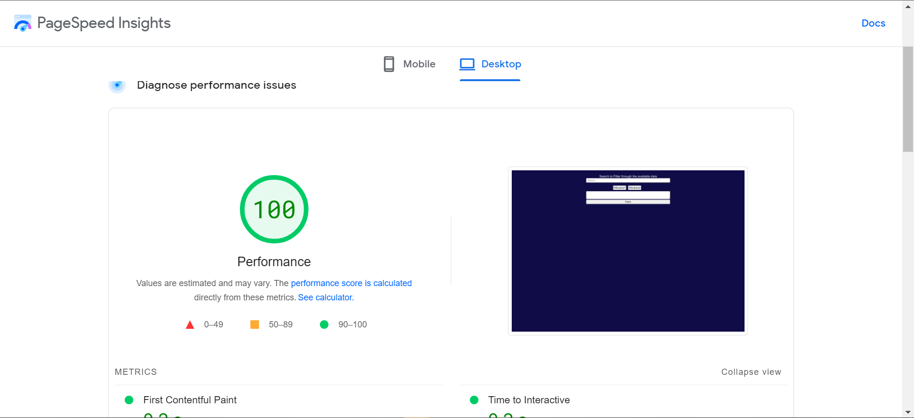

# Atlan Frontend Engineer Assessment

This project was bootstrapped with [Create React App](https://github.com/facebook/create-react-app).

The frontend development of a data analyst web app:

1. Two predefined set of query to load daa
2. Search and Filter input to filter through fetched data
3. Pagination to paginate a set of data per page.


# Performance Optimization and Profered Solution


## Page load time
Two tools was used to calculate the page load time and performance:
1. The google chrome lighthouse
2. Page Speed Insights.

## Google chrome lighthouse without optimization


## Google Performance check


## Page Speed Insight performance without optimization


## Page Speed Insight Metrics without optimization


## Project Setup

In the project directory, you can run:

``` sh
npm install
```

Runs the app in the development mode.\
Open [http://localhost:3000](http://localhost:3000) to view it in your browser with

``` sh
npm install
```